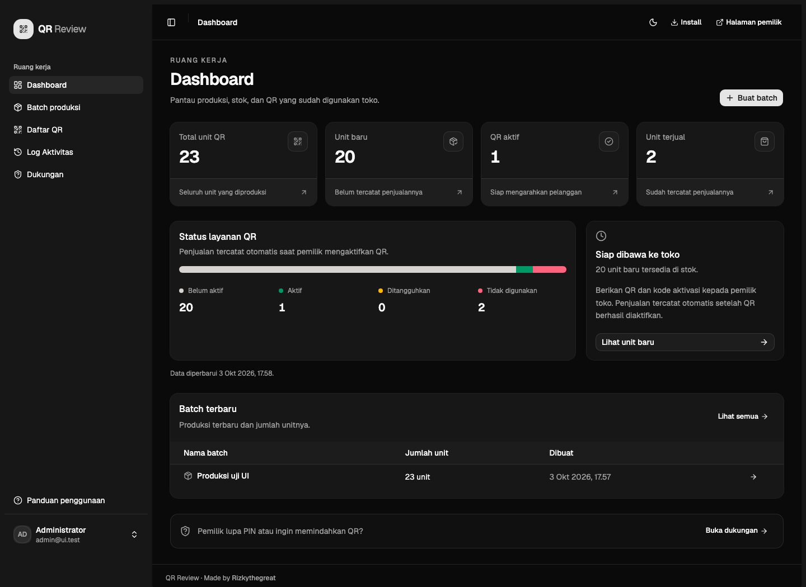
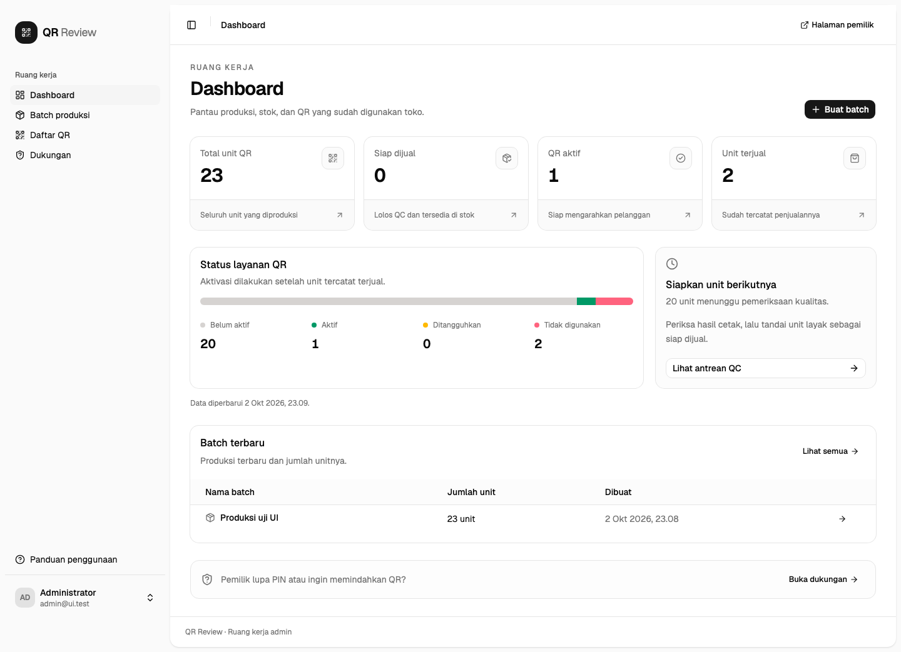
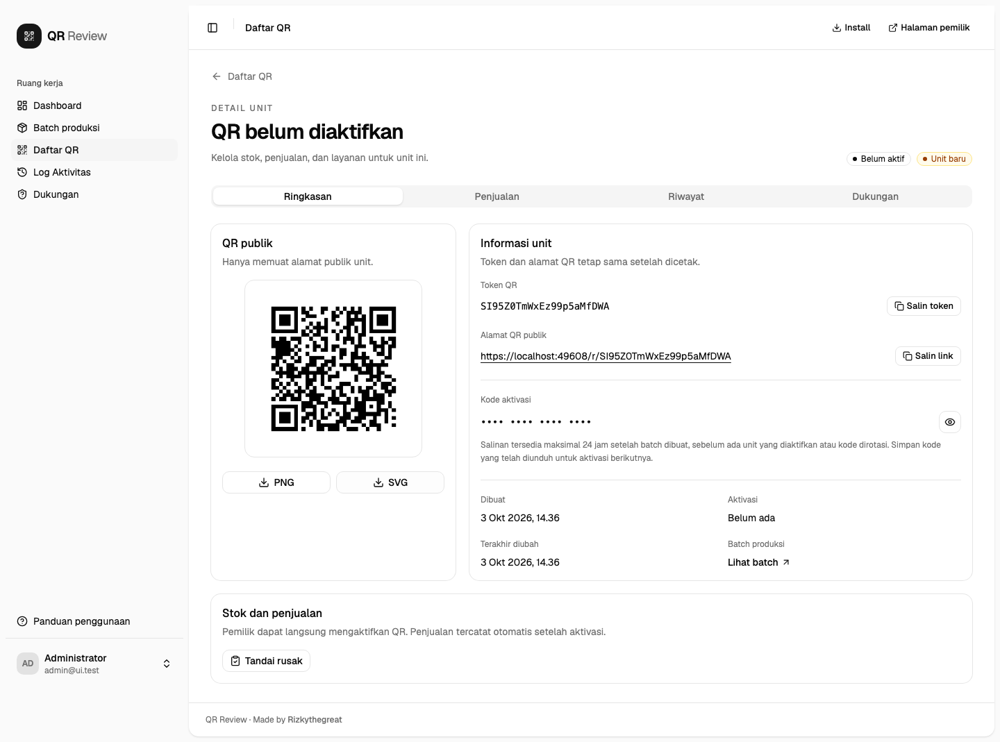
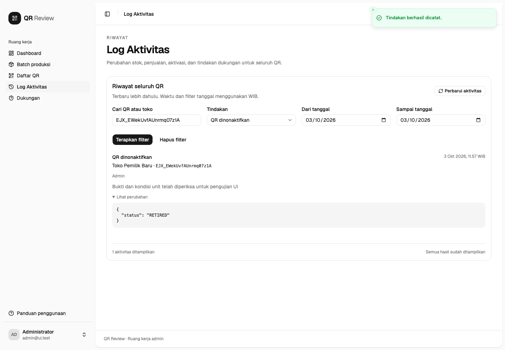
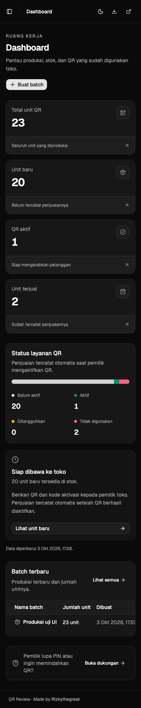
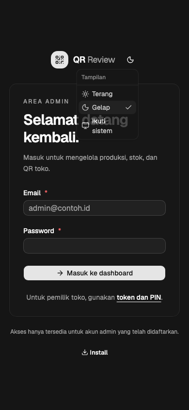
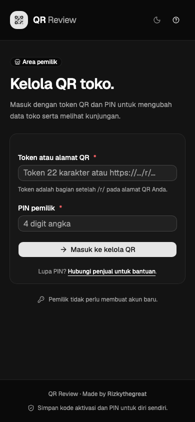

# QR Review

**Produksi QR, aktivasi toko, dan pengelolaan akses Google Review dalam satu aplikasi.**

QR Review membantu mengelola unit QR untuk toko dan kafe, mulai dari pembuatan batch hingga penggunaan oleh pemilik. Admin menyiapkan QR dan kode aktivasi; pemilik mengatur nama toko, tujuan ulasan, dan PIN. Link Google Review dapat diperbarui tanpa mencetak ulang QR.

[Preview](#preview) · [Fitur](#fitur-utama) · [Instalasi](#instalasi-lokal) · [Deployment](#deployment-ke-vercel) · [Dokumentasi](#dokumentasi)

## Preview

### Dashboard admin

Pantau produksi, stok, penjualan, dan status seluruh unit QR.

[](artifacts/ui/dashboard-dark-desktop.png)

<details>
<summary>Lihat dashboard dalam mode terang</summary>



</details>

### Informasi unit dan log aktivitas

| Informasi unit                                                                                                            | Log aktivitas                                                                                                               |
| ------------------------------------------------------------------------------------------------------------------------- | --------------------------------------------------------------------------------------------------------------------------- |
| [](artifacts/ui/qr-unit-desktop.png) | [](artifacts/ui/activity-desktop.png) |
| QR publik, unduhan, status, dan kode aktivasi dengan tombol tampil/sembunyikan.                                           | Riwayat perubahan dengan filter unit, toko, tindakan, dan tanggal.                                                          |

### Tampilan mobile

|                                                          Dashboard                                                          |                                                     Login admin                                                     |                                                          Halaman pemilik                                                           |
| :-------------------------------------------------------------------------------------------------------------------------: | :-----------------------------------------------------------------------------------------------------------------: | :--------------------------------------------------------------------------------------------------------------------------------: |
|  |  |  |

> Screenshot diambil dari aplikasi dalam lingkungan pengujian dengan data contoh. Klik gambar desktop untuk melihat ukuran penuh. Seluruh tangkapan tersedia di [`artifacts/ui`](artifacts/ui).

## Fitur utama

### Untuk admin

- **Produksi batch:** membuat 1–500 unit dengan token QR unik.
- **Ekspor untuk pencetakan:** PNG/SVG dan manifest dalam ZIP, dengan paket kode aktivasi yang terpisah.
- **Penjualan otomatis:** aktivasi pemilik langsung mencatat penjualan, waktu aktivasi, dan nama toko pembeli.
- **Pengelolaan unit:** informasi QR, unduhan, stok rusak, status layanan, dan riwayat tindakan.
- **Kode aktivasi tersensor:** salinan yang masih tersedia dapat dilihat atau disembunyikan melalui tombol mata.
- **Log aktivitas:** pencarian berdasarkan token/ID atau nama toko, filter tindakan, dan rentang tanggal WIB.
- **Dukungan pemilik:** reset PIN, transfer kepemilikan, rotasi kode, suspend/resume, dan penonaktifan permanen.

### Untuk pemilik dan pengunjung

- **Aktivasi mandiri:** menggunakan kode aktivasi, nama toko, link Google Review, dan PIN empat digit.
- **Akses tanpa membuat akun:** masuk ke halaman kelola menggunakan token dan PIN.
- **Tujuan ulasan yang dapat diperbarui:** perubahan link berlaku tanpa mengganti QR yang sudah dicetak.
- **Statistik kunjungan:** total kunjungan dan waktu akses terakhir untuk periode kepemilikan toko.
- **Tampilan responsif:** mendukung desktop, tablet, dan mobile dengan tema terang, gelap, atau mengikuti sistem.
- **Instalasi ke home screen:** membuka aplikasi dalam mode standalone, langsung ke halaman admin.

## Alur penggunaan

1. **Buat batch.** Admin menyiapkan unit dan mengunduh paket QR publik serta kode aktivasi.
2. **Serahkan ke toko.** Berikan QR dan kode aktivasi yang sesuai kepada pemilik.
3. **Aktifkan.** Pemilik mengisi data toko, link ulasan, dan PIN. Aktivasi serta pencatatan penjualan dilakukan dalam satu transaksi.
4. **Gunakan.** Pengunjung memindai QR dan diarahkan ke halaman Google Review toko.
5. **Kelola.** Pemilik memperbarui data dan melihat kunjungan; admin memantau stok, penjualan, dan dukungan.

Nama toko saat aktivasi tersimpan sebagai **Toko pembeli** pada penjualan otomatis. Perubahan nama toko atau kepemilikan berikutnya tidak mengubah catatan tersebut. Penjualan lama tetap menggunakan data yang sudah tercatat.

Salinan kode asli mengikuti masa berlaku snapshot batch: maksimal 24 jam setelah pembuatan, sebelum aktivasi atau rotasi kode unit mana pun dalam batch. Setelah salinan dihapus, gunakan paket yang telah diunduh atau rotasi kode untuk unit yang belum aktif.

## Teknologi

| Bagian              | Teknologi                                                 |
| ------------------- | --------------------------------------------------------- |
| Aplikasi dan API    | Next.js 16, React 19, TypeScript                          |
| Antarmuka           | Tailwind CSS 4, shadcn/ui, Lucide                         |
| Pengelolaan data UI | TanStack Query                                            |
| Database            | PostgreSQL melalui `pg`, dengan schema privat `qr_review` |
| Autentikasi admin   | Supabase Auth dan allowlist database                      |
| Autentikasi pemilik | PIN, sesi opaque, dan cookie aman                         |
| Ekspor              | QRCode, JSZip, dan job PostgreSQL                         |
| Tema                | next-themes                                               |
| Pengujian           | Vitest, PostgreSQL, Playwright/Chromium                   |

API berjalan pada runtime Node.js. Aktivasi, penjualan, audit, dan kepemilikan menggunakan transaksi PostgreSQL. Browser tidak mengakses tabel privat secara langsung; akses administratif diverifikasi melalui Supabase Auth dan allowlist di server.

## Instalasi lokal

### Prasyarat

- Node.js **20.19 atau lebih baru** dan npm.
- PostgreSQL **15 atau lebih baru**, lokal atau melalui Supabase.
- Project Supabase dengan Auth email/password untuk akun admin.

### 1. Siapkan repository

```bash
git clone https://github.com/rizkythegreat/qr-review-apps.git
cd qr-review-apps
npm ci
cp .env.example .env.local
```

### 2. Konfigurasi environment

Isi `.env.local` berdasarkan [`.env.example`](.env.example).

| Variabel                   | Fungsi                                                                                                                        |
| -------------------------- | ----------------------------------------------------------------------------------------------------------------------------- |
| `PUBLIC_ORIGIN`            | Origin HTTPS untuk link aplikasi dan QR yang dicetak. Tanpa path atau trailing slash; contoh lokal: `https://localhost:3000`. |
| `DATABASE_URL`             | Connection string PostgreSQL untuk runtime aplikasi. Mendukung koneksi direct dan pooler tanpa named prepared statements.     |
| `MIGRATION_DATABASE_URL`   | Opsional: koneksi dengan hak pemilik schema untuk migrasi dan provisioning admin.                                             |
| `DATABASE_SSL`             | `true` untuk koneksi Supabase dengan TLS; `false` untuk PostgreSQL lokal tanpa TLS.                                           |
| `DATABASE_SSL_CA`          | Isi sertifikat CA dalam format PEM bila diperlukan untuk validasi TLS database.                                               |
| `SUPABASE_URL`             | URL project Supabase untuk autentikasi.                                                                                       |
| `SUPABASE_PUBLISHABLE_KEY` | Publishable key atau legacy anon key dari project yang sama.                                                                  |
| `PIN_PEPPER`               | Kunci untuk melindungi hash PIN.                                                                                              |
| `HMAC_KEY`                 | Kunci untuk hash dan verifikasi internal.                                                                                     |
| `ENCRYPTION_KEY`           | Kunci enkripsi snapshot, arsip, dan respons rahasia.                                                                          |
| `TRUSTED_IP_HEADER`        | Opsional: header IP yang ditimpa proxy tepercaya; contoh Vercel: `x-vercel-forwarded-for`.                                    |
| `DATABASE_POOL_SIZE`       | Opsional: batas koneksi per pool; default `5`.                                                                                |
| `STATISTICS_TIMEOUT_MS`    | Opsional: batas eksekusi SQL statistik; default `150` ms.                                                                     |
| `TEST_TRAFFIC_SECRET`      | Opsional: penanda trafik pengujian untuk pengecualian statistik.                                                              |

Buat **tiga kunci berbeda**, masing-masing 32 byte acak dalam base64. Jalankan perintah berikut sekali untuk setiap kunci:

```bash
openssl rand -base64 32
```

Gunakan nilai kunci yang sama pada seluruh instance aplikasi dan worker. `.env.local` tidak boleh masuk ke Git.

Jika koneksi database memerlukan CA, gunakan sertifikat project Supabase dan pertahankan validasi TLS. Dalam `.env.local`, PEM dapat ditulis dengan `\n` di dalam nilai berpetik. Pada pengaturan environment hosting, masukkan nilai tanpa tanda petik luar. Hindari parameter SSL pada connection string yang mengganti konfigurasi CA aplikasi. Rincian tersedia di [panduan operasional](docs/operations.md).

### 3. Migrasi database dan daftarkan admin

Buat user email/password terlebih dahulu di Supabase Auth, lalu tambahkan UUID user tersebut ke allowlist:

```bash
npm run db:migrate
npm run admin:add -- UUID_USER_SUPABASE_AUTH
```

Migrasi berada di [`supabase/migrations`](supabase/migrations) dan dicatat dalam `qr_review.schema_migrations`. Tabel aplikasi berada di schema **`qr_review`**, bukan `public`.

### 4. Jalankan aplikasi

```bash
npm run dev
```

Buka `https://localhost:3000/admin/login`. Development menggunakan HTTPS agar cookie sesi pemilik yang bersifat Secure dapat bekerja. Sesuaikan `PUBLIC_ORIGIN` jika host atau port berubah.

Untuk memakai sertifikat development sendiri:

```bash
npm run dev -- --experimental-https-key=certificates/key.pem --experimental-https-cert=certificates/cert.pem
```

## Deployment ke Vercel

1. Jalankan migrasi pada database produksi dan daftarkan akun admin untuk environment tersebut.
2. Import repository GitHub ke Vercel dengan framework **Next.js**.
3. Tambahkan environment dari `.env.example` untuk environment tujuan. Gunakan origin HTTPS produksi sebagai `PUBLIC_ORIGIN`, serta database dan Auth Supabase yang sesuai.
4. Gunakan build command `npm run build`, lakukan deploy, lalu periksa login admin, aktivasi, dan ekspor.
5. Setelah mengubah environment variable, lakukan redeploy agar nilai baru digunakan aplikasi.

Tetapkan domain permanen `PUBLIC_ORIGIN` sebelum menghasilkan QR untuk pencetakan.

Konfigurasi repository mengaktifkan **Fluid Compute**. Ekspor diproses setelah respons API melalui `after()`, dan polling status dapat melanjutkan job tertunda. **Worker CLI terpisah tidak diperlukan untuk alur ekspor Vercel ini.** Pemrosesan tetap mengikuti batas waktu dan ukuran file yang dikonfigurasi; lihat [panduan deployment dan pemulihan job](docs/operations.md#pilihan-deployment).

Maintenance memerlukan scheduler terpisah; repository ini belum mengatur jadwal tersebut secara otomatis. Deployment ke Cloudflare Workers memerlukan adaptasi runtime dan pengujian tambahan. Static export tidak mencakup API dan sesi aplikasi.

## Job dan maintenance

### Worker untuk hosting Node.js persisten

Sebagai alternatif alur Vercel, jalankan worker dengan database, origin, dan kunci yang sama:

```bash
npm run worker
```

Untuk memproses satu job:

```bash
npm run worker -- --once
```

Job disimpan di PostgreSQL dengan lease dan kontrol konkurensi. Ekspor publik terpisah dari kode aktivasi; snapshot dan arsip rahasia tersimpan dalam bentuk terenkripsi.

### Pembersihan berkala

Jadwalkan perintah berikut **setiap menit**:

```bash
npm run maintenance
```

Rutinitas ini membersihkan rahasia kedaluwarsa, sesi lama, grant kedaluwarsa, bucket rate limit, dan scan event mentah berumur lebih dari 90 hari. Statistik agregat per kepemilikan dipertahankan. Expiry juga diperiksa pada operasi aplikasi, sehingga tidak bergantung pada ketepatan scheduler. Audit dan penjualan tidak dihapus otomatis.

### Reset data operasional

[`scripts/sql/reset-app-data.sql`](scripts/sql/reset-app-data.sql) tersedia untuk memulai ulang data operasional secara manual. Struktur database, ledger migrasi, allowlist admin, dan akun Supabase Auth dipertahankan. QR, sesi, dan link operasional sebelumnya tidak berlaku setelah reset. Periksa script dan simpan backup sebelum menjalankannya.

## API dan akses

Kontrak lengkap tersedia dalam [`openapi-qr-review-v0.1.yaml`](openapi-qr-review-v0.1.yaml).

| Akses                  | Autentikasi                                                                   |
| ---------------------- | ----------------------------------------------------------------------------- |
| Admin                  | Bearer Supabase Auth yang diverifikasi server dan UUID dalam allowlist.       |
| Pemilik                | Token dan PIN saat login; cookie Secure/HttpOnly serta CSRF untuk mutasi.     |
| Aktivasi dan pemulihan | Kode aktivasi atau grant dukungan sesuai operasi, dengan pemeriksaan origin.  |
| Scan publik            | `/r/{token}` memeriksa status unit dan mengarahkan QR aktif ke tujuan ulasan. |

- Kontrol versi menggunakan `X-QR-If-Match: "vN"`, berdasarkan `version` dari API. `If-Match` standar juga diterima; gunakan `X-QR-If-Match` di Vercel.
- Operasi yang ditandai kontrak memerlukan UUID `Idempotency-Key`. Retry jaringan memakai key, payload, dan versi awal yang sama.
- PIN berupa string empat digit, termasuk nol awal. Body JSON dibatasi 16 KiB.
- Link ulasan yang didukung: `https://g.page/r/{code}/review` dan `https://search.google.com/local/writereview?placeid={id}`. Server tidak me-resolve short-link Google.
- Statistik menghitung kunjungan QR aktif yang memenuhi syarat, bukan ulasan yang dikirim ke Google. HEAD, bot/preview, dan trafik pengujian teridentifikasi dikecualikan.
- API dan resolver menggunakan `Cache-Control: no-store`. Hosting perlu mempertahankan HTTPS dan forwarded headers yang tepercaya.

## Install ke home screen

Aplikasi menyediakan manifest, ikon, dan tampilan standalone. Tombol **Install** tersedia di header admin dan halaman login admin. Aplikasi terpasang dimulai dari `/admin`; jika belum ada sesi, pengguna diarahkan ke login.

Gunakan tombol Install atau menu instalasi pada browser yang mendukungnya. Di Safari iPhone/iPad, pilih **Bagikan → Tambahkan ke Layar Utama**. Halaman publik di dalam aplikasi terpasang menyediakan akses kembali ke admin. Data tetap memerlukan koneksi internet.

## Pengembangan dan pengujian

| Perintah                           | Kegunaan                                      |
| ---------------------------------- | --------------------------------------------- |
| `npm run dev`                      | Development dengan HTTPS.                     |
| `npm run build`                    | Build produksi.                               |
| `npm start`                        | Server produksi; gunakan ingress HTTPS.       |
| `npm run typecheck`                | Pemeriksaan TypeScript.                       |
| `npm run lint`                     | Analisis statis.                              |
| `npm test`                         | Tes unit.                                     |
| `npm run test:integration`         | Tes integrasi PostgreSQL.                     |
| `npm run verify:ui`                | Verifikasi browser Chromium.                  |
| `npm run verify:runtime`           | Verifikasi resolver dan runtime.              |
| `npm run verify:runtime -- --load` | Pengujian 20 request/detik selama lima menit. |

Untuk verifikasi UI dengan build terpisah:

```bash
npx playwright install chromium
QR_REVIEW_DIST_DIR=.next-ui-verification npm run build
npm run verify:ui
```

Tes integrasi dan verifier membuat database sementara. Default menggunakan PostgreSQL lokal dan user sistem operasi. Jika diisi, `TEST_DATABASE_URL` harus menunjuk database kontrol khusus pengujian dengan izin create/drop database dan, untuk tes RLS, create/drop role. Verifier juga memerlukan `openssl` dan port localhost yang tersedia.

Verifikasi UI menggunakan Auth simulasi dengan pemeriksaan signature JWT, tanpa mengubah data Supabase produksi. Login Supabase asli, deployment, restore, dan pencetakan fisik perlu diperiksa pada environment yang bersangkutan.

Laporan tersedia dalam [verifikasi UI](artifacts/ui-verification.json), [verifikasi runtime](artifacts/runtime-verification.json), dan [cakupan implementasi](docs/implementation.md).

## Struktur repository

```text
src/
  app/                 Halaman, layout, dan route Next.js
  components/          Antarmuka admin dan publik
  hooks/               State dan aksi antarmuka
  lib/                 Tipe, format, dan client API
  server/              Domain, autentikasi, dan persistensi
supabase/migrations/   Migrasi SQL
scripts/               Provisioning, job, dan verifier
scripts/sql/           Operasi SQL manual
tests/                 Tes unit dan integrasi
artifacts/             Laporan dan screenshot aplikasi
docs/                  Dokumentasi teknis dan operasional
```

## Dokumentasi

| Dokumen                                         | Isi                                                    |
| ----------------------------------------------- | ------------------------------------------------------ |
| [PRD](PRD_Akrilik_QR_Review_MVP.md)             | Scope awal, aturan produk, dan acceptance criteria.    |
| [OpenAPI](openapi-qr-review-v0.1.yaml)          | Endpoint, payload, respons, dan error.                 |
| [Implementasi backend](docs/implementation.md)  | Pemetaan aturan dan bukti pengujian.                   |
| [Implementasi UI](docs/ui-implementation.md)    | Alur, komponen, dan bukti browser.                     |
| [Operasional dan pemulihan](docs/operations.md) | Deployment, job, monitoring, TLS, backup, dan restore. |

## Kredit

Made by **[Rizkythegreat](https://rizkyrahmansalam.my.id)**.
